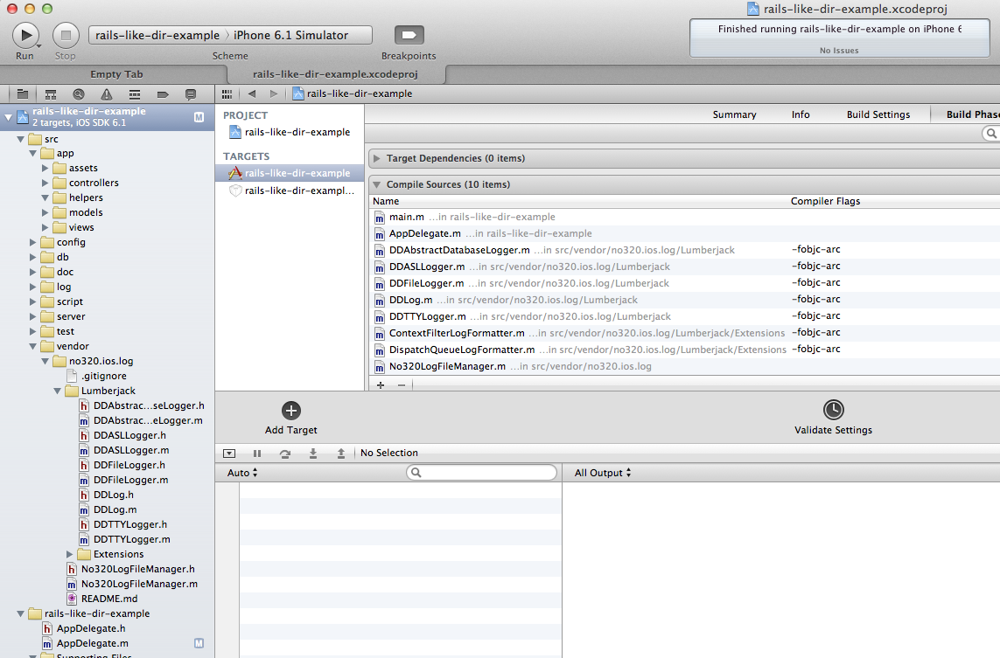

# no320.ios.log

该项目代码是基于CocoaLumberjack这个ios 日志框架的扩展。

## 特性

### 指定目录输出日志

默认输入日志目录

	src/log/

当日志文件大于1.1m的时候会自动归档。


一般，我习惯这样用

	➜  rails-like-dir-example git:(master) ✗ tail -f src/log/log-08EF39.txt 
		14  CoreFoundation                      0x01c4e962 __CFRunLoopDoSource1 + 146
		15  CoreFoundation                      0x01c7fbb6 __CFRunLoopRun + 2118
		16  CoreFoundation                      0x01c7ef44 CFRunLoopRunSpecific + 276
		17  CoreFoundation                      0x01c7ee1b CFRunLoopRunInMode + 123
		18  GraphicsServices                    0x01c337e3 GSEventRunModal + 88
		19  GraphicsServices                    0x01c33668 GSEventRun + 104
		20  UIKit                               0x0005affc UIApplicationMain + 1211
		21  rails-like-dir-example              0x00002c5a main + 170
		22  rails-like-dir-example              0x00002b65 start + 53

### 增加5个日志宏，类似于log4j


	#define log_fatal(fmt, ...) DDLogError((@"%s [FATAL] " fmt), __FUNCTION__, ##__VA_ARGS__)
	#define log_error(fmt, ...) DDLogError((@"%s [ERROR] " fmt), __FUNCTION__, ##__VA_ARGS__)
	#define log_warning(fmt, ...) NSLog((@"%s [WARNING] " fmt), __FUNCTION__, ##__VA_ARGS__)
	#define log_info(fmt, ...) DDLogInfo((@"%s [INFO] " fmt), __FUNCTION__, ##__VA_ARGS__)
	#define log_debug(fmt, ...) DDLogVerbose((@"%s [VERBOSE] " fmt), __FUNCTION__, ##__VA_ARGS__)

让它看起和log4j的很像


### 无入侵
如果需要更新CocoaLumberjack版本，
从https://github.com/robbiehanson/CocoaLumberjack/tree/master/Lumberjack下载，放到vendor中即可。


## 用法说明

	


### 初始化

 
- 把依赖文件加到项目文件中

把no320.ios.log/文件夹加到项目文件中

注意CocoaLumberjack默认是arc的，如果你的项目是非arc的，需要增加-fobjc-arc说明

参见https://github.com/robbiehanson/CocoaLumberjack/wiki/GettingStarted





### 修改AppDelegate.m文件


- 引入资源文件

建议在prefix.pch里


```c
	#import "No320LogFileManager.h"
```

- 增加[self setNo320LogConfig];方法

```c
	- (BOOL)application:(UIApplication *)application didFinishLaunchingWithOptions:(NSDictionary *)launchOptions
	{
      
	    ....
		[self setNo320LogConfig];
	    ....
	    return YES;
	}
```

### 示例代码


    log_info(@"%s:%d:%s:%s\n", __func__, __LINE__, __FILE__,__PRETTY_FUNCTION__);
    log_warning(@"%@\n",NSStringFromSelector(_cmd));
    log_fatal(@"%@\n",NSStringFromClass([self class]));
    log_error(@"%@\n",[NSString stringWithUTF8String:__FILE__] );
    log_debug(@"%@\n",[NSThread callStackSymbols]);


是不是很简单?


## History

v0.1.0

## Contributors

alfred.sang


## License

If you are using ios-test-unit in your project, I'd love to hear about it.  Let me 
know at shiren1118@126.com.

In short, this is the MIT License.

Copyright (c) 2013 no320.com Inc.

Permission is hereby granted, free of charge, to any person obtaining a copy
of this software and associated documentation files (the "Software"), to deal
in the Software without restriction, including without limitation the rights
to use, copy, modify, merge, publish, distribute, sublicense, and/or sell
copies of the Software, and to permit persons to whom the Software is
furnished to do so, subject to the following conditions:

The above copyright notice and this permission notice shall be included in
all copies or substantial portions of the Software.

THE SOFTWARE IS PROVIDED "AS IS", WITHOUT WARRANTY OF ANY KIND, EXPRESS OR
IMPLIED, INCLUDING BUT NOT LIMITED TO THE WARRANTIES OF MERCHANTABILITY,
FITNESS FOR A PARTICULAR PURPOSE AND NONINFRINGEMENT. IN NO EVENT SHALL THE
AUTHORS OR COPYRIGHT HOLDERS BE LIABLE FOR ANY CLAIM, DAMAGES OR OTHER
LIABILITY, WHETHER IN AN ACTION OF CONTRACT, TORT OR OTHERWISE, ARISING FROM,
OUT OF OR IN CONNECTION WITH THE SOFTWARE OR THE USE OR OTHER DEALINGS IN
THE SOFTWARE.
